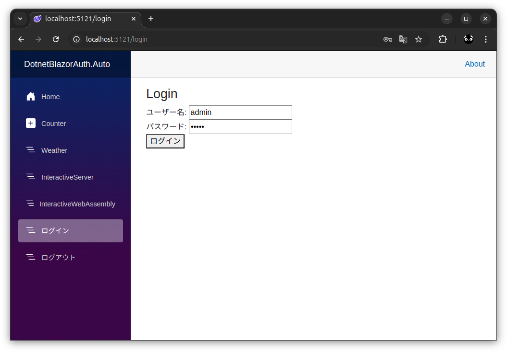
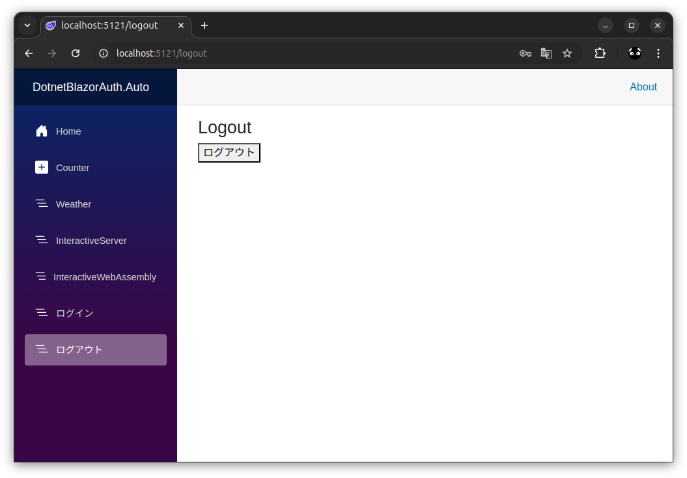
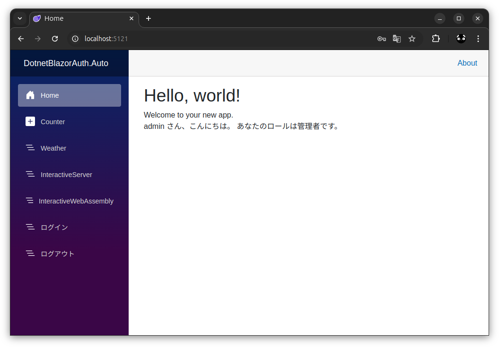
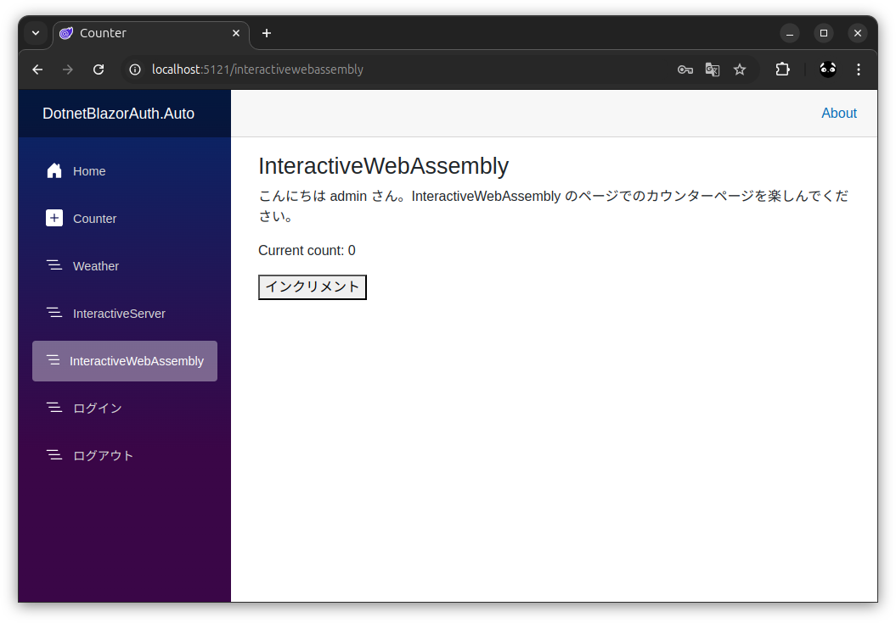
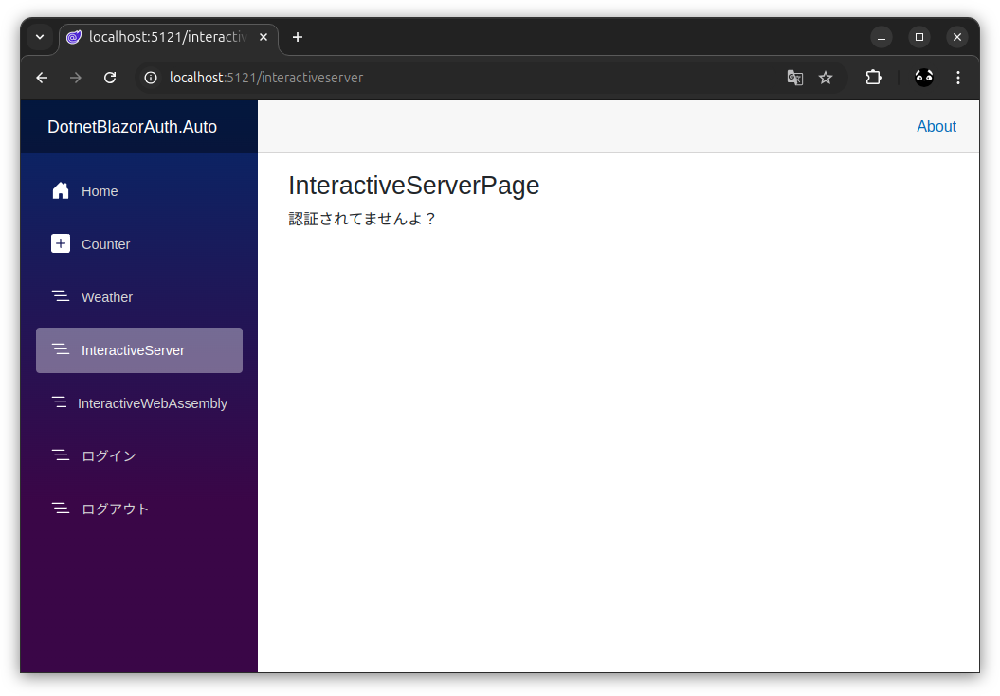

# DotnetBlazorAuth.Auto

## 概要
`blazor --interactivity  Auto` で作成したプロジェクトに認証を追加する。 

### 参照
.NET 8 の Blazor にオレオレ ログイン機能を付けよう  
https://zenn.dev/microsoft/articles/aspnetcore-blazor-dotnet8-tryaddauth  

### 目次
* [認証を使うための準備](#認証を使うための準備)
  * [サーバーからクライアントに渡すユーザー情報を格納するクラスを作成](#サーバーからクライアントに渡すユーザー情報を格納するクラスを作成)
  * [サーバーからクライアントに認証情報を渡すためのクラスを作成](#サーバーからクライアントに認証情報を渡すためのクラスを作成)
  * [Program.cs に認証関係の処理を追加](#programcs-に認証関係の処理を追加)
  * [_Imports.razor に using を追加](#_importsrazor-に-using-を追加)
* [認証を使ったページを追加](#認証を使ったページを追加)
  * [ログインページを作成](#ログインページを作成)
  * [ログアウトページを作成　※元記事には無いです](#ログアウトページを作成元記事には無いです)
  * [Home ページにログインユーザー名表示を追加](#home-ページにログインユーザー名表示を追加)
  * [InteractiveServer ページを追加](#interactiveserver-ページを追加)
  * [InteractiveWebAssembly ページを追加 ※元記事では Counter.razor を変更](#interactivewebassembly-ページを追加-元記事では-counterrazor-を変更)
  * [追加したページをメニューに追加](#追加したページをメニューに追加)

### イメージ
  
  
  
  
  
  

## 認証を使うための準備

### サーバーからクライアントに渡すユーザー情報を格納するクラスを作成
【クライアント側】  
`DotnetBlazorAuth.Auto.Client/UserInfo.cs`  
```cs
namespace DotnetBlazorAuth.Auto.Client;

public record UserInfo(string Name, string Role);
```

### サーバーからクライアントに認証情報を渡すためのクラスを作成

【サーバー側】  
`DotnetBlazorAuth.Auto/PersistingServerAuthenticationStateProvider.cs`  
対象のファイルを作成  
※ソースは実物見て

【クライアント側】  
`DotnetBlazorAuth.Auto.Client/PersistentAuthenticationStateProvider.cs`  
対象のファイルを作成  
※ソースは実物見て

### Program.cs に認証関係の処理を追加

【サーバー側】  
`DotnetBlazorAuth.Auto/Program.cs`  
以下を追加

※注意！  
元記事の「認証認可のミドルウェアを追加」の位置では以下のエラーが発生するため注意
* Blazor 認証認可で「A valid antiforgery token was not provided with the request.」エラーが発生した場合の対応 2024-08-08  
  https://hackmd.io/@jkofK/r11pxez90  
  > app.UseAuthorization(); の順番を入れ替えると正常に動作する。
* Blazor antiforgery token issue when posting form (SSR) when user is logged in #50612  
  https://github.com/dotnet/aspnetcore/issues/50612#issuecomment-1722177730  

```
using DotnetBlazorAuth;
using Microsoft.AspNetCore.Authentication.Cookies;
using Microsoft.AspNetCore.Components.Authorization;

〜〜〜〜〜〜〜〜〜〜〜〜〜〜〜〜〜〜〜〜〜〜〜〜〜〜〜〜〜〜〜〜〜〜

// 認証系サービスの追加
builder.Services
    .AddAuthentication(CookieAuthenticationDefaults.AuthenticationScheme)
    .AddCookie();

// Blazor用の認証情報を提供するためのコンポーネント
builder.Services.AddScoped<AuthenticationStateProvider, PersistingServerAuthenticationStateProvider>();

// 認証情報を CascadingParameter で渡すようにする
builder.Services.AddCascadingAuthenticationState();

〜〜〜〜〜〜〜〜〜〜〜〜〜〜〜〜〜〜〜〜〜〜〜〜〜〜〜〜〜〜〜〜〜〜

// 認証認可のミドルウェアを追加 ※app.UseAntiforgery() より前に追加すること
app.UseAuthentication();
app.UseAuthorization();
```

【クライアント側】  
`DotnetBlazorAuth.Auto.Client/Program.cs`
以下を追加

```cs
using DotnetBlazorAuth.Auto.Client;
using Microsoft.AspNetCore.Components.Authorization;

〜〜〜〜〜〜〜〜〜〜〜〜〜〜〜〜〜〜〜〜〜〜〜〜〜〜〜〜〜〜〜

// 以下の3行を追加
builder.Services.AddScoped<AuthenticationStateProvider, PersistentAuthenticationStateProvider>();
builder.Services.AddCascadingAuthenticationState();
builder.Services.AddAuthorizationCore();
```

### _Imports.razor に using を追加

【サーバー側】  
`DotnetBlazorAuth.Auto/Components/_Imports.razor`  
以下を追加

```html
@using Microsoft.AspNetCore.Components.Authorization
```

【クライアント側】  
`DotnetBlazorAuth.Auto.Client/_Imports.razor`  
以下を追加

```html
@using Microsoft.AspNetCore.Components.Authorization
```

## 認証を使ったページを追加

### ログインページを作成

【サーバー側】  
`DotnetBlazorAuth.Auto/Components/Pages/Login.razor`  
対象のファイルを作成  
※ソースは実物見て

### ログアウトページを作成　※元記事には無いです

【サーバー側】  
`DotnetBlazorAuth.Auto/Components/Pages/Logout.razor`  
対象のファイルを作成  
※ソースは実物見て

### Home ページにログインユーザー名表示を追加

【サーバー側】  
`DotnetBlazorAuth.Auto/Components/Pages/Home.razor`  
以下を追加

```html
<div>
    <AuthorizeView>
        @context.User.Identity!.Name さん、こんにちは。
    </AuthorizeView>

    <AuthorizeView Roles="Administrator">
        あなたのロールは管理者です。
    </AuthorizeView>

    <AuthorizeView Roles="User">
        あなたのロールは一般ユーザーです。
    </AuthorizeView>
</div>
```

### InteractiveServer ページを追加

【サーバー側】  
`DotnetBlazorAuth.Auto/Components/Pages/InteractiveServerPage.razor`  
対象のファイルを作成  
※ソースは実物見て

【クライアント側】  
### InteractiveWebAssembly ページを追加 ※元記事では Counter.razor を変更
`DotnetBlazorAuth.Auto.Client/Pages/InteractiveWebAssemblyPage.razor`  
対象のファイルを作成  
※ソースは実物見て

### 追加したページをメニューに追加

【サーバー側】  
`DotnetBlazorAuth.Auto/Components/Layout/NavMenu.razor`  
以下を追加

```html
        <div class="nav-item px-3">
            <NavLink class="nav-link" href="interactiveserver">
                <span class="bi bi-list-nested-nav-menu" aria-hidden="true"></span> InteractiveServer
            </NavLink>
        </div>

        <div class="nav-item px-3">
            <NavLink class="nav-link" href="interactivewebassembly">
                <span class="bi bi-list-nested-nav-menu" aria-hidden="true"></span> InteractiveWebAssembly
            </NavLink>
        </div>

        <div class="nav-item px-3">
            <NavLink class="nav-link" href="login">
                <span class="bi bi-list-nested-nav-menu" aria-hidden="true"></span> ログイン
            </NavLink>
        </div>

        <div class="nav-item px-3">
            <NavLink class="nav-link" href="logout">
                <span class="bi bi-list-nested-nav-menu" aria-hidden="true"></span> ログアウト
            </NavLink>
        </div>
```